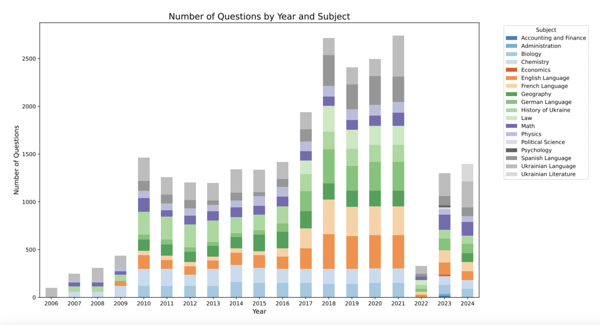
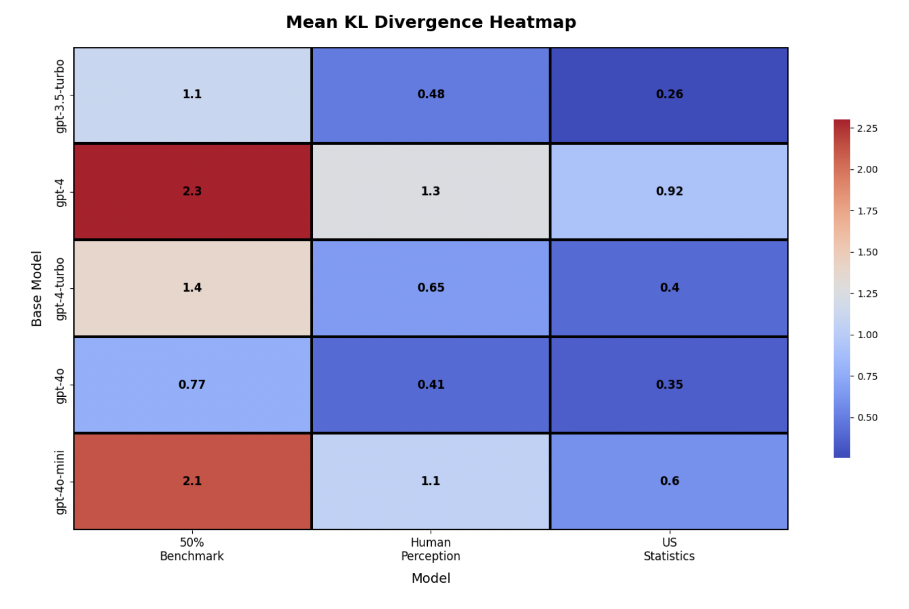
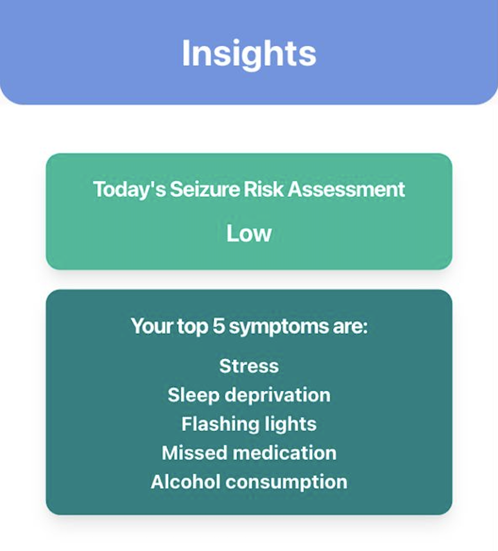
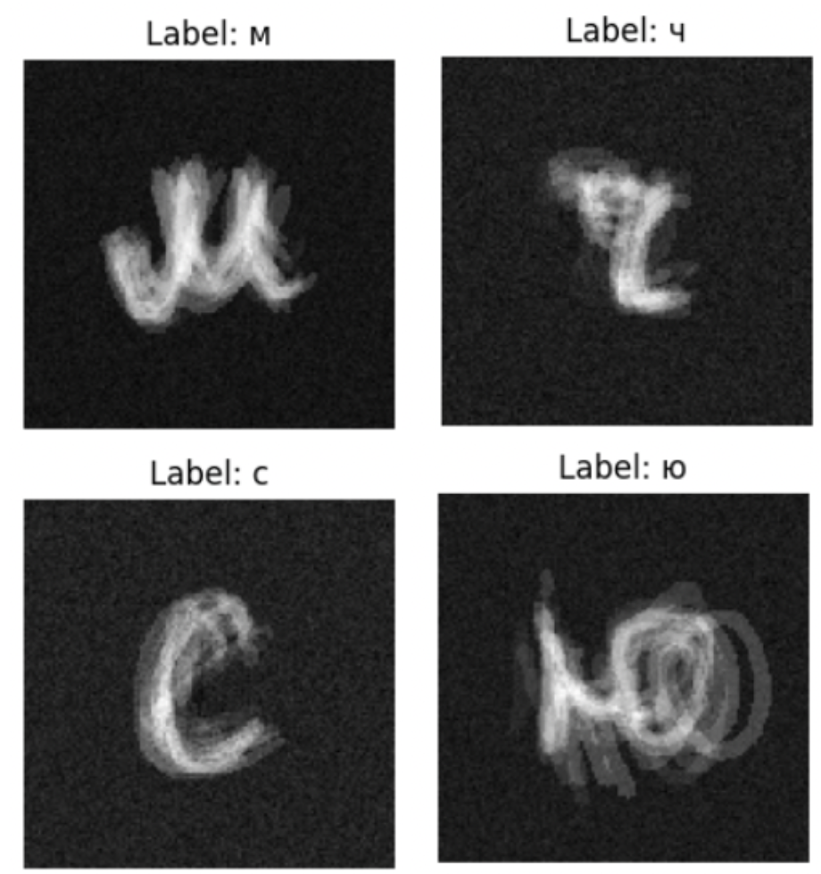
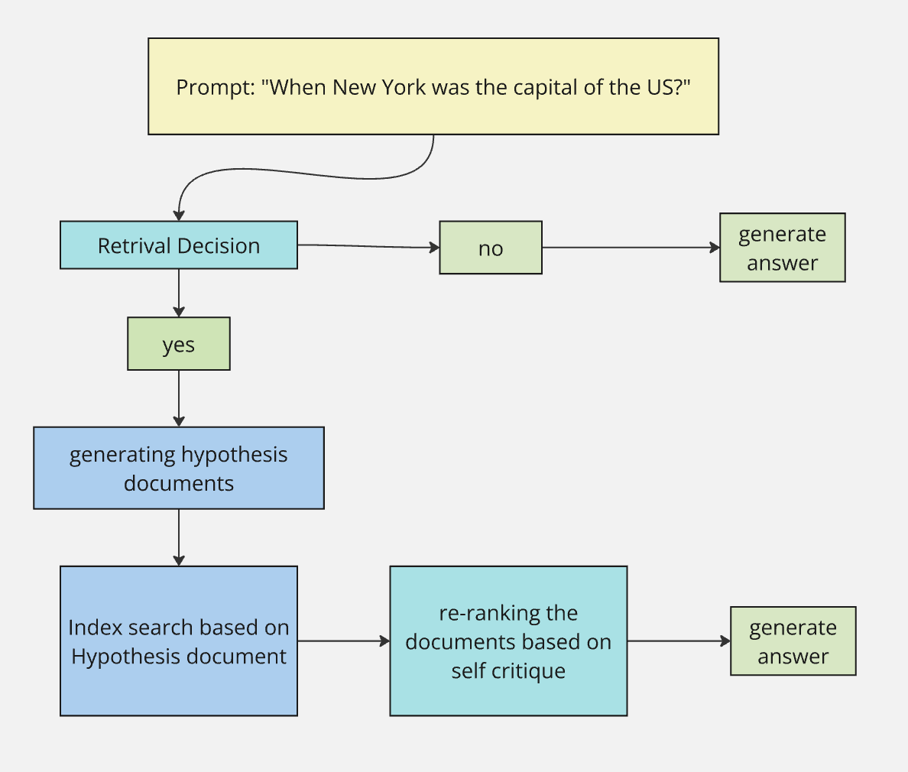
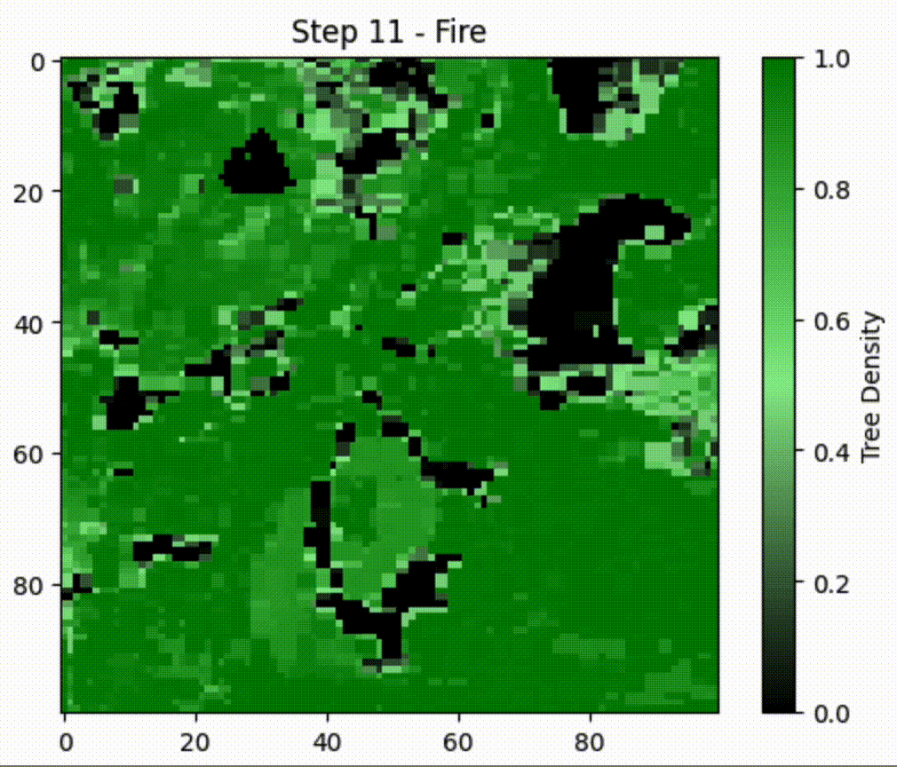
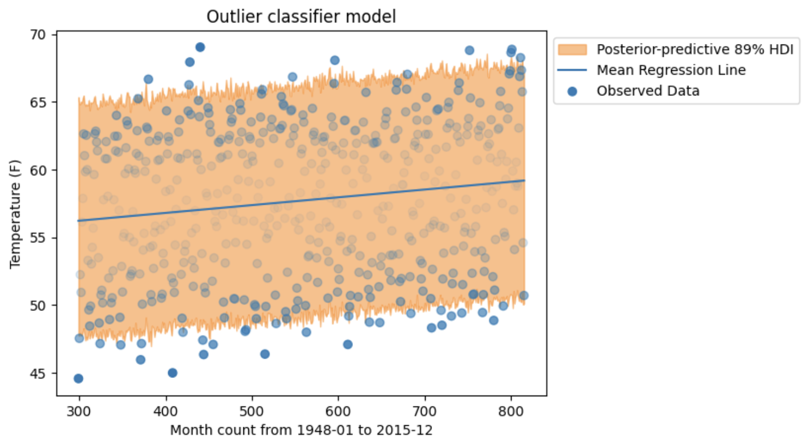
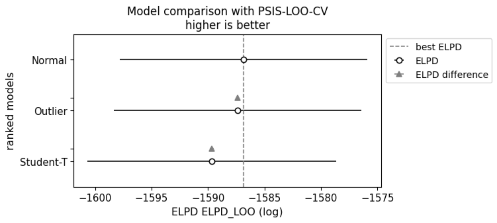
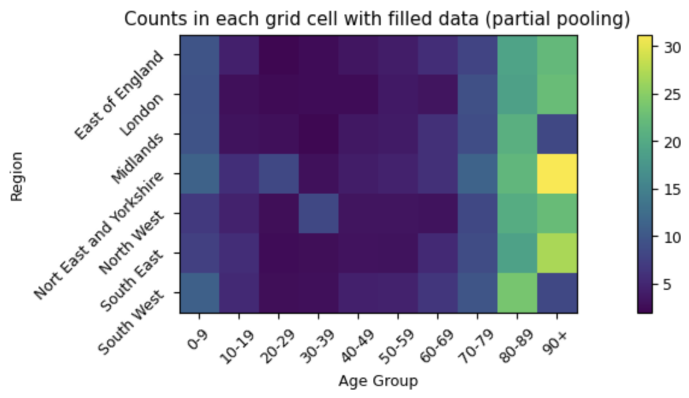

# Hi! I am Tanya

San Francisco, CA  
Email: tetianabass17@gmail.com  
[LinkedIn](https://www.linkedin.com/in/tetiana-bas/) | [GitHub](https://github.com/tanya-bas)

**Skills:** Python (NumPy, Pandas, Scikit-learn, JAX, Pytorch, Tensorflow, PyG, NetworkX, Transformers), LangGraph, Pinecone, LlamaIndex, Langfuse, SQL, GCP, AWS, Git  
**Languages:** Ukrainian (native), Russian (native), English (fluent), Spanish (advanced), French (advanced), Polish (intermediate)

---

## Projects 

### Evaluating Multimodal LLMs on Reasoning Tasks in Low-Resource Languages *(accepted to ACL 2025)*
Co-authored a research paper introducing reasoning and cultural misattribution benchmarks for low resource languages across 12 disciplines. Set up evaluations for classification, identification and generation tasks.

---

### Large-Scale Gender Bias Analysis in Language Models *(under peer review)*
Engineered a framework for generating new benchmarking datasets anchoring them in the social science studies. Expanded dataset diversity 5x for gender bias detection in LLMs.  
Implemented a forced-choice, zero-shot classification method by comparing the log-likelihoods of each candidate label and KL divergence for alignment assessment.

---

### SeizureSavvy
Researched state-of-the-art models for seizure forecasting, implemented an LSTM model achieving 84% prediction accuracy. Deployed XGBoost to identify and rank top seizure triggers, providing actionable insights for patient care. Designed the database schema and data pipeline to collect, store, and analyze patient-reported symptoms and episodes.

---

### OCR Data Scarcity
Built a handwritten character recognition system (CNN) for use cases with data scarcity. Used conditional variational autoencoders (CVAE) and GANs to overcome data scarcity, manually creating a custom dataset. Combined CVAE for latent space manipulation and GAN architectures with progressive upsampling to generate synthetic training samples.

---

### PensionGPT (Twilio, Llama LLM, TogatherAI, Pinecone DB)
Developed WhatsApp based multi-agent system for multilingual pension assistance, achieved 80% successful query resolution on 100+ test cases and got validated by Bulgarian pension administration officials.  
Implemented agentic workflow for ambiguity detection in user input, benefits eligibility assessment and pension calculation, achieving 78% accuracy on complex queries.

---

### Self-HyDE: Self-Reflective Hypothetical Document Embeddings
Researched a new RAG system by replicating and combining approaches outlined in HyDE and SelfRAG papers, with custom Wikipedia-based document index and improved retrieval pipeline. Evaluated system using ROUGE and semantic similarity scoring, demonstrating improved retrieval quality and answer accuracy.

---

### Road Traffic Network Simulation for Data-Driven Urban Planning
Designed a traffic congestion simulation using OSMnx and NetworkX with 73% alignment with historical traffic congestion data, comparing Berlin and San Francisco road networks through dynamic car movement and density-based jam detection. Created a theoretical model using graph theory for analytical estimations of traffic dynamics, utilizing edge betweenness centrality to predict congestion patterns and validate against empirical simulation results.

---

### ForestFire Spread
Developed a forest fire simulation in British Columbia using environmental factors (wind, density, temperature, humidity). Designed and evaluated 3 fire mitigation strategies demonstrating that random firebreaks reduced forest burn percentage by 50% compared to targeted high-risk area interventions. Conducted percolation analysis and theoretical modeling using renormalization group theory to derive mathematical relationships between wind strength and fire spread probability, validating empirical results against theoretical predictions.

---

### Bayesian Modeling for San Francisco Temperature Prediction
Developed linear regression models with normal, student-t, and outlier detection likelihood functions to predict the temperature dynamics in San Francisco. Performed model comparison using PSIS leave-one-out cross-validation.

---

### Bayesian Modeling for UK GP Visit Estimations
Developed complete pooling and partial pooling Zero-Inflated Poisson models with PyMC to estimate missing values of average GP visits across geographical regions, and age groups in the UK. Performed model comparison using PSIS leave-one-out cross-validation.

---

